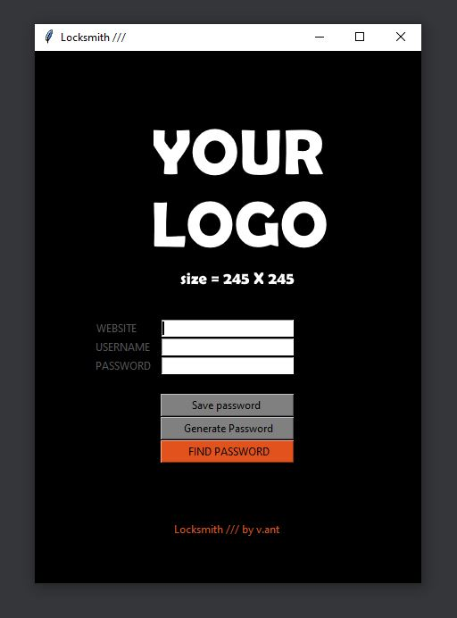

# Locksmith-Password_manager

Desktop password manager written in Tkinter

This is a little project I wrote to keep my passwords all in one place (txt file) on my drive.
The user interface is very intuitive: We can either save, generate or search for a password we already saved. 

Just place your personal logo (245*245, png) and you are ready to go. 

